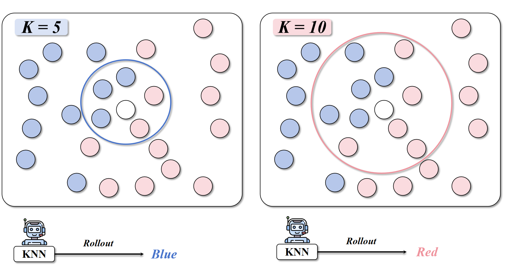
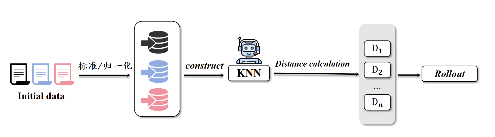

# KNN-for-information-resources-management

信息资源管理课程个人作业 —— **KNN 算法在 MNIST 手写数字识别中的应用**  
作者：刘又玮
指导教师：米允龙  
> 本人负责本次作业中的 **KNN 算法实现与分析部分**。  
> 数据集与代码均已开源，Notebook/脚本可复现基础结果。


---

## 📘 项目简介

本项目基于 **KNN（K-Nearest Neighbors）算法**，对经典的 **MNIST 手写数字数据集** 进行分类实验。  
目标是通过最邻近原则，让模型在 28×28 像素灰度图上自动识别数字 0–9。(这里处理后的data是csv, 已同样开源)

- **算法思想**：KNN 是一种基于实例的懒惰学习方法。对新样本，计算其与训练集中所有样本的距离，选出最近的 K 个邻居，通过多数表决或加权投票决定分类结果。  
- **实验目的**：掌握 KNN 的基本原理、距离度量、K 值影响与精度评估方法。  
- **实现工具**：`Python + NumPy + pandas + scikit-learn + matplotlib`  

---


---

## 📊 数据集介绍

- **名称**：MNIST（Modified National Institute of Standards and Technology）  
- **规模**：共 70,000 张 28×28 的灰度手写数字图片  
  - 训练集：60,000 张  
  - 测试集：10,000 张  
- **类别**：数字 0–9 共 10 类  
- **数据格式**：每张图片展开为 784 维向量；像素值范围 0–255，可归一化到 [0,1]

> 数据来源：[Yann LeCun 官方 MNIST 页面](http://yann.lecun.com/exdb/mnist/)  
> 或 [Kaggle: Digit Recognizer (MNIST in CSV)](https://www.kaggle.com/competitions/digit-recognizer)

---

## ⚙️ 算法原理概述

**K 近邻算法（KNN）** 的主要思想：

1. **计算距离**  
   对于输入样本 \( x \)，计算它与训练集中所有样本 \( x_i \) 的欧氏距离  
   \[
   d(x, x_i) = \sqrt{\sum_{j=1}^{784}(x_j - x_{ij})^2}
   \]
2. **选取最近的 K 个邻居**  
   取出距离最小的 K 个样本组成集合 \( \mathcal{N}_K(x) \)。
3. **投票决策**  
   统计各类别出现次数，选择出现最多的类别作为预测输出：  
   \[
   \hat{y}(x) = \arg\max_j \sum_{x_i\in\mathcal{N}_K(x)} \mathbf{1}\{y_i=j\}
   \]
4. **（可选）距离加权**  
   也可按距离反比赋权，使离得更近的样本权重更大：  
   \[
   w_i = \frac{1}{d(x,x_i)+\varepsilon}
   \]

> 实现使用 scikit-learn 中的 `KNeighborsClassifier`：  
> 默认距离为 Minkowski (p=2)，即欧氏距离；支持 `weights="uniform"` 或 `weights="distance"`。

---


### 1️⃣ 安装依赖
```bash
pip install -U numpy pandas matplotlib scikit-learn

